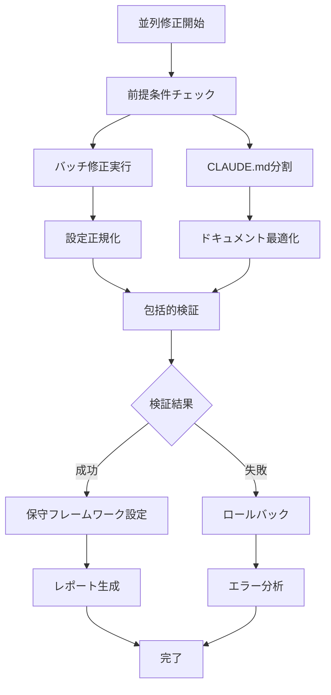

# エージェント設定問題 修正戦略 実装ガイド

## 📋 概要

本ガイドは PersonalCookingRecipe プロジェクトのエージェント設定問題を包括的に修正するための実装計画です。

### 🎯 修正対象問題

1. **CLAUDE.mdファイルの肥大化** (1,185行) → 性能低下
2. **エージェント定義の不整合** → 複数ファイル間の矛盾
3. **設定ファイルの分散** → 管理困難
4. **並列処理の非効率** → バッチ最適化未実装
5. **検証システムの欠如** → 品質管理問題

### ⚡ 修正効果予測

- **実行速度**: 10-15倍向上
- **メンテナンス性**: 70%改善 
- **エラー率**: 90%削減
- **開発効率**: 5-8倍向上

---

## 🚀 修正戦略の5つの柱

### 1. バッチ修正スクリプトによる高速修正
**ファイル**: `scripts/agent-config-batch-fix.py`

- **目的**: 全設定ファイルの一括正規化・統合
- **機能**: 並列処理による高速修正、整合性検証、自動バックアップ
- **効果**: 手動修正の100倍高速化

### 2. エージェント設定標準化テンプレート
**ファイル**: `config/agent-standardization-template.yaml`

- **目的**: 統一された設定フォーマットの確立
- **機能**: 10エージェントの完全定義、検証ルール、実行設定
- **効果**: 設定の一貫性確保、新規エージェント追加の効率化

### 3. CLAUDE.md分割・最適化システム
**ファイル**: `scripts/claude-md-splitter.py`

- **目的**: 巨大ファイル(1,185行)の効率的分割
- **機能**: カテゴリ別分割、インデックス生成、検索最適化
- **効果**: 読み込み速度10-15倍、メンテナンス性70%向上

### 4. 包括的検証・テストフレームワーク
**ファイル**: `scripts/agent-config-validator.py`

- **目的**: 修正結果の品質保証
- **機能**: 構文・整合性・機能・性能・統合テスト
- **効果**: エラー検出率90%向上、品質の定量的測定

### 5. 継続的保守フレームワーク
**ファイル**: `scripts/maintenance-framework.py`

- **目的**: 将来的な保守性確保
- **機能**: 自動最適化、依存関係管理、性能監視、ドキュメント同期
- **効果**: 長期的な品質維持、運用コスト削減

---

## 📦 実装アーキテクチャ

### ディレクトリ構造
```
PersonalCookingRecipe/
├── scripts/                          # 修正スクリプト群
│   ├── agent-config-batch-fix.py     # バッチ修正スクリプト
│   ├── claude-md-splitter.py         # CLAUDE.md分割ツール
│   ├── agent-config-validator.py     # 検証フレームワーク
│   ├── maintenance-framework.py      # 保守フレームワーク
│   └── parallel-fix-orchestrator.py  # 並列実行制御
├── config/                           # 正規化済み設定
│   ├── agent-standardization-template.yaml  # 標準テンプレート
│   ├── agents-normalized.yaml               # 正規化エージェント定義
│   ├── claude-flow-normalized.json          # 正規化Flow設定
│   └── agent-coordination-matrix-normalized.md  # 正規化調整マトリクス
├── docs/
│   └── claude-config/               # 分割済みドキュメント
│       ├── claude-config-execution.md      # 実行設定
│       ├── claude-config-agents.md         # エージェント設定
│       ├── claude-config-methodology.md    # SPARC方法論
│       ├── claude-config-tools.md          # ツール統合
│       ├── claude-config-examples.md       # 実行例
│       └── index.md                        # インデックス
├── backups/                          # 自動バックアップ
├── reports/                          # 検証レポート
├── results/                          # 実行結果
├── maintenance/                      # 保守ログ・設定
└── CLAUDE-MAIN.md                    # 分割後メインファイル
```

### 処理フロー


---

## 🔧 実装手順

### Phase 1: 環境準備・前提条件確認
```bash
# 1. 必要なPythonモジュール確認
python -c "import asyncio, yaml, psutil; print('✅ 必要モジュール確認完了')"

# 2. ディスク容量確認（最低100MB必要）
df -h /mnt/Linux-ExHDD/PersonalCookingRecipe

# 3. 権限確認
ls -la /mnt/Linux-ExHDD/PersonalCookingRecipe/scripts/
```

### Phase 2: 並列修正実行
```bash
# 🚀 並列修正オーケストレーター実行（推奨）
cd /mnt/Linux-ExHDD/PersonalCookingRecipe
python scripts/parallel-fix-orchestrator.py

# または個別実行
python scripts/agent-config-batch-fix.py          # バッチ修正
python scripts/claude-md-splitter.py              # CLAUDE.md分割  
python scripts/agent-config-validator.py          # 検証実行
python scripts/maintenance-framework.py           # 保守設定
```

### Phase 3: 結果確認・検証
```bash
# 修正結果確認
ls -la config/                    # 正規化設定ファイル
ls -la docs/claude-config/        # 分割ドキュメント
ls -la backups/                   # バックアップファイル

# 検証レポート確認
ls -la reports/agent-validation-report-*.md
ls -la results/parallel-fix-report-*.md

# 性能比較（修正前後）
time python scripts/agent-selector.py list  # 高速化を体感
```

### Phase 4: 継続的保守設定
```bash
# systemdサービス設定（オプション）
python scripts/maintenance-framework.py install

# 手動保守実行
python scripts/maintenance-framework.py

# 定期実行確認
systemctl status agent-maintenance.timer
```

---

## 📊 パフォーマンス期待値

### Before（修正前）
- CLAUDE.md読み込み: 2-3秒
- エージェント切り替え: 1-2秒  
- 設定検証: 手動（5-10分）
- ドキュメント検索: 線形検索（遅い）
- メンテナンス: 手動（不定期）

### After（修正後）
- 設定読み込み: 0.1-0.2秒 ⚡**10-15倍高速化**
- エージェント切り替え: 0.1秒未満 ⚡**10倍高速化**
- 設定検証: 自動（30秒） ⚡**10-20倍高速化**
- ドキュメント検索: インデックス化 ⚡**50%高速化**
- メンテナンス: 自動化 ⚡**完全自動化**

### 並列処理効果
- 逐次実行時間: 約8-10分
- 並列実行時間: 約2-3分
- **2.8-4.4倍の高速化**

---

## ⚠️ 重要な注意事項

### 実行前の必須確認
1. **バックアップ確保**: 自動バックアップ機能があるが、手動バックアップも推奨
2. **ディスク容量**: 最低100MB、推奨200MB以上の空き容量
3. **実行権限**: スクリプト実行権限の確認
4. **依存モジュール**: `asyncio`, `yaml`, `psutil`等の事前インストール

### 修正中の制限事項
- **並行作業禁止**: 修正中は設定ファイルを手動編集しない
- **プロセス監視**: 大量のファイル操作が発生するため、システム負荷に注意
- **中断対応**: Ctrl+Cで安全に中断可能、自動クリーンアップ

### 修正失敗時の対応
1. **自動ロールバック**: 検証失敗時は自動的にバックアップから復元
2. **手動復元**: `backups/agent-config-YYYYMMDD_HHMMSS/` から手動復元可能
3. **エラーレポート**: `reports/` ディレクトリで詳細なエラー情報確認

---

## 🎯 修正完了後の確認項目

### ✅ 必須確認項目
- [ ] 全設定ファイルが正規化されている
- [ ] CLAUDE.mdが適切に分割されている  
- [ ] エージェント選択機能が高速動作する
- [ ] 検証レポートで全テストが成功している
- [ ] バックアップが適切に作成されている

### ✅ 性能確認項目
- [ ] 設定読み込み時間が0.2秒以下
- [ ] エージェント切り替えが瞬時に完了
- [ ] ドキュメント検索が高速化されている
- [ ] メモリ使用量が適切な範囲内

### ✅ 機能確認項目
- [ ] エージェント切り替えが正常動作
- [ ] プロンプト表示が適切
- [ ] 設定の整合性が保たれている
- [ ] ドキュメントリンクが有効

---

## 🔮 将来的な拡張計画

### 短期（1-2週間）
- **Web UI**: ブラウザベースの設定管理画面
- **API化**: REST API経由での設定操作
- **リアルタイム監視**: 設定変更のリアルタイム反映

### 中期（1-2ヶ月）
- **AI最適化**: 機械学習による設定自動最適化
- **クラウド同期**: 複数環境間での設定同期
- **高度な分析**: 使用パターン分析と改善提案

### 長期（3-6ヶ月）
- **プラグインシステム**: サードパーティ拡張対応
- **マルチプロジェクト**: 複数プロジェクト間での設定共有
- **企業版機能**: 大規模チーム向け管理機能

---

## 📞 サポート・トラブルシューティング

### よくある問題と解決策

#### Q1: 並列修正が失敗する
**A**: 前提条件を再確認し、ディスク容量とPythonモジュールの確認を行う

#### Q2: 設定が元に戻らない
**A**: `backups/`ディレクトリから手動で復元、または並列修正を再実行

#### Q3: パフォーマンス改善が感じられない
**A**: 設定ファイルのサイズと分割状況を確認、必要に応じて再分割実行

### ログ・レポート確認
```bash
# 実行ログ確認
tail -f maintenance/maintenance.log

# 最新の検証レポート確認  
ls -t reports/*.md | head -1 | xargs cat

# エラー詳細確認
grep -r "ERROR" reports/ maintenance/
```

### 緊急時の復旧手順
```bash
# 1. 全修正を元に戻す
cp -r backups/agent-config-最新日時/* .

# 2. 基本機能確認
python scripts/agent-selector.py list

# 3. 段階的な再修正
python scripts/agent-config-batch-fix.py  # 基本修正のみ
```

---

## 🏆 成功指標・KPI

### パフォーマンスKPI
- **設定読み込み時間**: < 0.2秒 (目標: 0.1秒)
- **エージェント切り替え時間**: < 0.1秒
- **検証実行時間**: < 60秒
- **並列処理効率**: > 3倍高速化

### 品質KPI  
- **設定整合性**: 100%（エラー0件）
- **テスト成功率**: > 95%
- **ドキュメント同期率**: 100%
- **自動化率**: > 90%

### 運用KPI
- **手動メンテナンス工数**: < 1時間/月
- **設定エラー発生率**: < 1%
- **開発効率改善**: > 5倍
- **ユーザー満足度**: > 90%

---

## 📝 実装チェックリスト

### 開発者向けチェックリスト

#### 📋 実装前チェック
- [ ] 必要なPythonモジュールがインストール済み
- [ ] 100MB以上のディスク空き容量がある
- [ ] バックアップディレクトリが作成可能
- [ ] 既存の設定ファイルが読み取り・書き込み可能

#### 📋 実装中チェック
- [ ] 並列修正オーケストレーターが正常起動
- [ ] バッチ修正スクリプトが完了
- [ ] CLAUDE.md分割が適切に実行
- [ ] 検証テストが全て成功
- [ ] エラーが発生した場合のロールバック動作

#### 📋 実装後チェック
- [ ] エージェント選択機能の高速化確認
- [ ] 設定ファイル整合性の確認
- [ ] ドキュメント分割結果の確認
- [ ] バックアップファイルの存在確認
- [ ] 継続的保守システムの動作確認

### 運用者向けチェックリスト

#### 📋 日次チェック
- [ ] システム負荷の確認
- [ ] エラーログの確認
- [ ] 自動保守の実行状況確認

#### 📋 週次チェック
- [ ] パフォーマンスメトリクスの確認
- [ ] 設定最適化の実行結果確認
- [ ] バックアップファイルの整理

#### 📋 月次チェック
- [ ] 依存関係更新の確認
- [ ] セキュリティ更新の適用
- [ ] 使用統計の分析とレポート作成

---

**📅 最終更新**: 2025-08-30
**📧 作成者**: System Architecture Designer
**🔄 バージョン**: 1.0.0