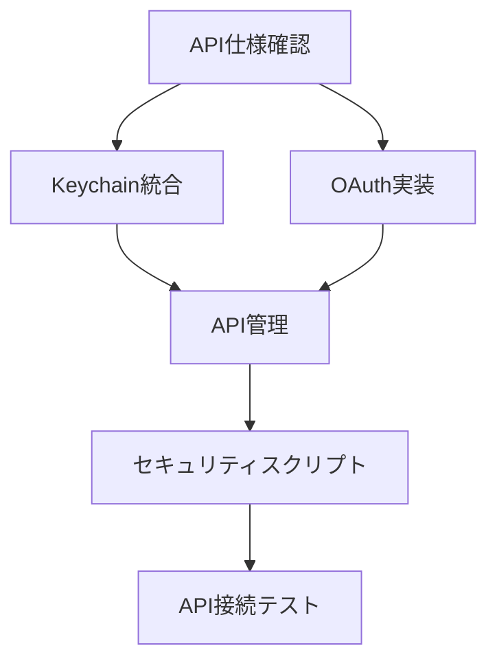
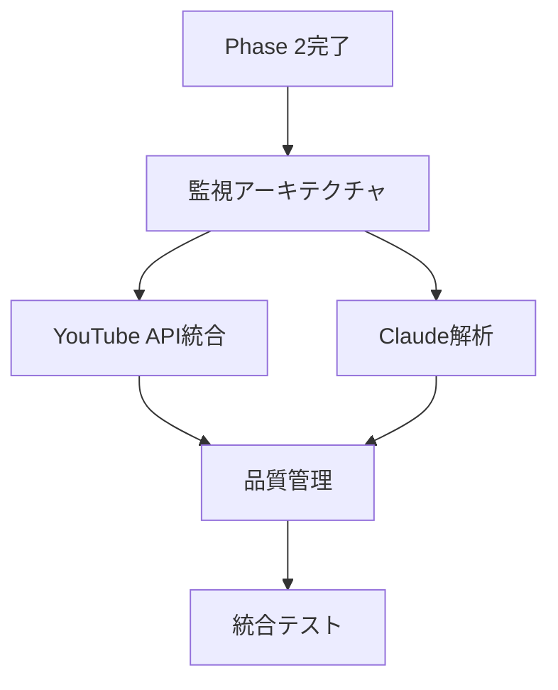

# PersonalCookRecipe - Agent Coordination Matrix
# Recipe-Manager エージェント間調整マトリクス

## 🤖 エージェント構成と責任範囲

### 👥 Agent Team Overview
| Agent ID | Name | Primary Role | Current Status |
|----------|------|--------------|----------------|
| cto | Recipe-CTO | 技術戦略・アーキテクチャ | 🟡 待機中 |
| dev-api | Recipe-DevAPI | API統合・バックエンド | 🟡 待機中 |  
| dev-ui | Recipe-DevUI | React UI・フロントエンド | 🟡 待機中 |
| qa | Recipe-QA | 品質保証・テスト | 🟡 待機中 |
| manager | Recipe-Manager | 進捗管理・品質統括 | 🟢 稼働中 |

## 🔄 Phase別責任マトリクス

### Phase 2: API認証システム構築 (優先実装)

| Task | Primary | Secondary | Review | Deliverable |
|------|---------|-----------|--------|-------------|
| API仕様確認・セキュリティ設計 | Recipe-CTO | - | Recipe-Manager | 技術仕様書 |
| macOS Keychain統合実装 | Recipe-DevAPI | Recipe-CTO | Recipe-QA | keychain_manager.py |
| OAuth認証ヘルパー | Recipe-DevAPI | - | Recipe-CTO | oauth_helper.py |
| API認証情報管理 | Recipe-DevAPI | Recipe-CTO | Recipe-QA | api_manager.py |
| セキュリティスクリプト | Recipe-DevAPI | Recipe-CTO | Recipe-QA | secure_api_keys.sh |
| API接続テスト | Recipe-QA | Recipe-DevAPI | Recipe-Manager | test_api_connections.py |

### Phase 3: 3チャンネル監視システム構築

| Task | Primary | Secondary | Review | Deliverable |
|------|---------|-----------|--------|-------------|
| 統合監視アーキテクチャ | Recipe-CTO | Recipe-DevAPI | Recipe-Manager | システム設計書 |
| YouTube API統合 | Recipe-DevAPI | Recipe-CTO | Recipe-QA | channel_monitors.py |
| 肉料理検出エンジン | Recipe-DevAPI | Recipe-CTO | Recipe-QA | meat_recipe_detector.py |
| Claude特化解析 | Recipe-DevAPI | Recipe-CTO | Recipe-QA | claude_analyzer.py |
| 品質管理・重複除去 | Recipe-DevAPI | Recipe-QA | Recipe-Manager | quality_controller.py |
| 統合テスト | Recipe-QA | Recipe-DevAPI | Recipe-Manager | 監視システムテストレポート |

### Phase 4: Notion統合・UI実装

| Task | Primary | Secondary | Review | Deliverable |
|------|---------|-----------|--------|-------------|
| Notion API統合 | Recipe-DevAPI | Recipe-CTO | Recipe-QA | notion_client.py |
| レシピページ生成 | Recipe-DevAPI | Recipe-DevUI | Recipe-QA | page_generator.py |
| React UI設計・実装 | Recipe-DevUI | Recipe-DevAPI | Recipe-QA | React Components |
| Gmail通知システム | Recipe-DevAPI | - | Recipe-QA | gmail_notifier.py |
| LaunchDaemon設定 | Recipe-DevAPI | Recipe-CTO | Recipe-QA | setup_launchd.sh |
| 統合UI/APIテスト | Recipe-QA | Recipe-DevUI | Recipe-Manager | E2Eテストレポート |

## 🔀 Dependency Management

### Phase 2 Dependencies (Critical Path)

**ボトルネック識別**:
- API仕様確認 (Recipe-CTO) → 全体の開始トリガー
- Keychain統合 (Recipe-DevAPI) → 後続実装の前提条件

### Phase 3 Dependencies

## 📊 Communication Protocols

### Daily Standup (仮想)
**時間**: 毎日 9:00 AM (JST)  
**参加者**: 全エージェント
**フォーマット**:
- 昨日の成果物
- 今日の予定タスク  
- ブロッカー・依存関係
- 品質懸念事項

### 週次品質レビュー
**時間**: 毎週金曜 17:00 (JST)
**参加者**: 全エージェント + Recipe-Manager主導
**アジェンダ**:
- 品質メトリクス確認
- コードレビュー結果
- テスト実行結果  
- 次週計画調整

## 🚨 Escalation Matrix

### Issue Severity & Response
| Severity | Description | Primary Response | Secondary | Manager |
|----------|-------------|------------------|-----------|---------|
| P0 | システム障害・セキュリティ | 担当エージェント | Recipe-CTO | Recipe-Manager |
| P1 | 機能障害・API問題 | 担当エージェント | 関連エージェント | Recipe-Manager |
| P2 | 品質問題・パフォーマンス | Recipe-QA | 担当エージェント | Recipe-Manager |
| P3 | 改善提案・ドキュメント | 提案エージェント | Recipe-Manager | - |

### Conflict Resolution
1. **技術判断**: Recipe-CTO が最終決定
2. **品質基準**: Recipe-QA が基準適用判断
3. **スケジュール**: Recipe-Manager が調整・最終決定
4. **実装方針**: Recipe-DevAPI/DevUI が実装方針決定

## 📋 Work Distribution Strategy

### Current Priority Allocation
**Phase 2 (緊急)**: 
- Recipe-CTO: 40% (仕様・設計)
- Recipe-DevAPI: 60% (実装)
- Recipe-QA: 20% (テスト準備)

### Workload Balancing
- **高負荷時**: 相互支援体制活用
- **専門外作業**: Primary-Secondary体制でナレッジ共有
- **品質問題**: Recipe-QA主導で全エージェント支援

## 🔄 Handoff Procedures

### Phase間のハンドオフ
1. **Deliverable確認**: 成果物の品質・完成度検証
2. **Knowledge Transfer**: 技術的知見の共有
3. **Test Results**: テスト結果・品質メトリクス移譲
4. **Documentation**: 実装ドキュメント・課題の引き継ぎ

### エージェント間のハンドオフ  
1. **Context Sharing**: 作業コンテキスト・決定事項共有
2. **Code Review**: 実装内容の相互確認
3. **Issue Tracking**: 未解決課題・技術的債務の継承
4. **Quality Gates**: 品質基準クリア確認

## 📊 Progress Tracking

### Individual Agent Metrics
| Agent | Tasks Assigned | Completed | In Progress | Blocked | Quality Score |
|-------|----------------|-----------|-------------|---------|---------------|
| Recipe-CTO | 0 | 0 | 0 | 0 | - |
| Recipe-DevAPI | 0 | 0 | 0 | 0 | - |
| Recipe-DevUI | 0 | 0 | 0 | 0 | - |
| Recipe-QA | 0 | 0 | 0 | 0 | - |
| Recipe-Manager | 3 | 1 | 2 | 0 | 85% |

### Team Collaboration Metrics
- **Cross-agent reviews**: 0 completed
- **Knowledge sharing sessions**: 0 conducted
- **Conflict resolutions**: 0 incidents
- **Delivery handoffs**: 0 completed

## 🎯 Optimization Opportunities

### Process Improvements
1. **Parallel Development**: Phase内での並行作業最大化
2. **Early Testing**: 実装と並行でのテスト作成
3. **Continuous Integration**: 品質チェックの自動化
4. **Documentation as Code**: 実装と同期したドキュメント更新

### Communication Improvements
1. **Async Updates**: 進捗の非同期共有促進
2. **Decision Logs**: 技術的決定の記録・共有
3. **Blocker Alerts**: 依存関係問題の早期発見
4. **Cross-training**: エージェント間のスキル共有

## 📞 Next Actions

### Immediate (Today)
- [ ] Recipe-CTO: API仕様確認・セキュリティ設計着手
- [ ] Recipe-DevAPI: 開発環境準備・実装計画策定
- [ ] Recipe-QA: テストフレームワーク・テストケース準備
- [ ] Recipe-Manager: 進捗監視・課題管理継続

### Short-term (1-2 Days)  
- [ ] 全エージェント: Phase 2実装開始
- [ ] 定期進捗確認サイクル確立
- [ ] 品質基準の実装・適用
- [ ] エージェント間調整プロセス確立

---

**📊 COORDINATION STATUS**: 🟡 SETUP PHASE
**📅 NEXT SYNC**: Daily progress check
**🎯 FOCUS**: Phase 2 API認証システム実装開始

---
**Managed by**: Recipe-Manager Agent  
**Last Updated**: 2025-08-07
**Version**: 1.0